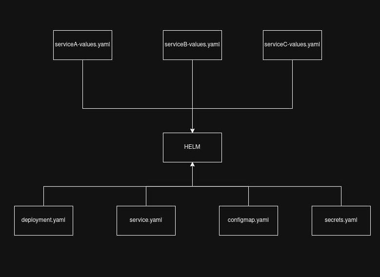

## 🚀 HELM

**Helm** is a popular package manager for Kubernetes that simplifies deploying, managing, and sharing applications.

---

### 📌 Helm Command

> **Command**
> ```bash
> helm upgrade --install <release_name> ./helm -f values.yaml
> ```


Parameters:

- <release_name> – Unique name for the service (e.g., service-a, cart, redis)
- ./helm – Path to the Helm chart
- values.yaml – Service-specific configuration file

### 📌 Helm Flow Chart

