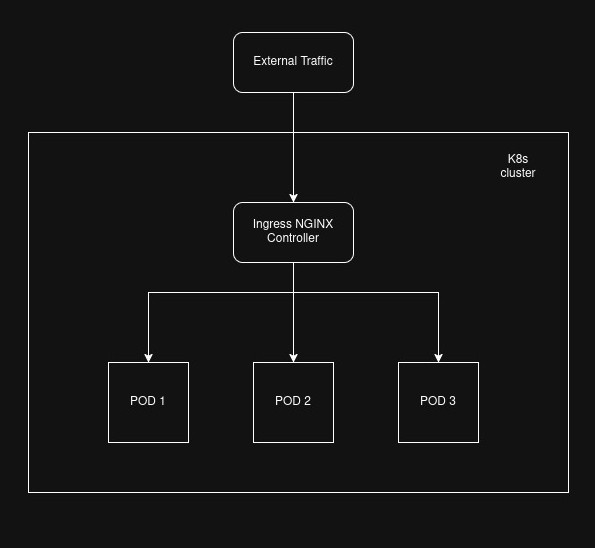
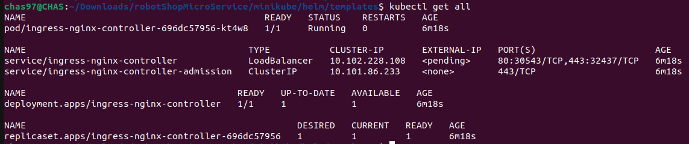

## Community maintained Ingress Nginx Controller

https://github.com/kubernetes/ingress-nginx



---

1. Add the Ingress NGINX Controller repo to helm

```bash
helm repo add ingress-nginx https://kubernetes.github.io/ingress-nginx
helm repo update
```

2. Install the Ingress NGINX Controller

```bash
helm install ingress-nginx ingress-nginx/ingress-nginx --namespace ingress-nginx --set controller.replicaCount=1 --set controller.service.type=LoadBalancer
```



3. Verify ClusterRole

```bash
kubectl get clusterrole ingress-nginx
```